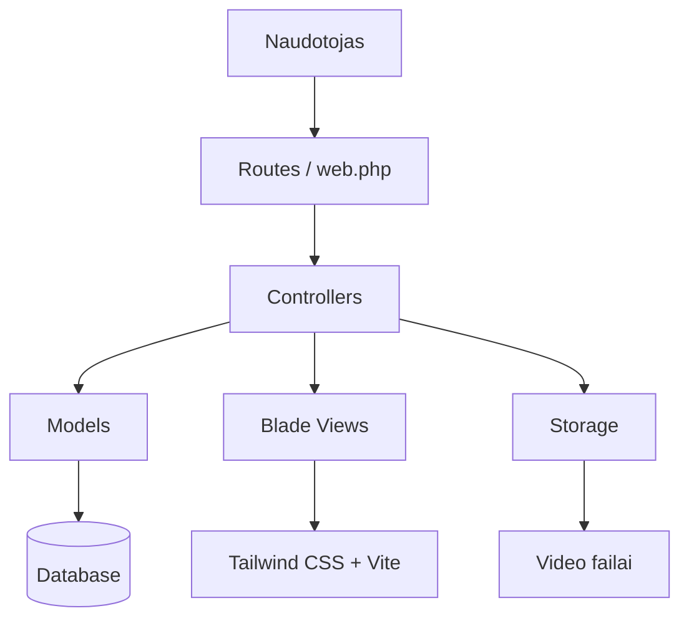

# Barako kulinarija 🍲

**Barako kulinarija** – studentams ir visiems taupantiems skirtas kulinarinis internetinis puslapis, kuriame galima rasti pigių, greitų ir paprastų receptų, patarimų bei idėjų, kaip skaniai pavalgyti neišleidžiant daug pinigų.

Projektas kuriamas naudojant **Laravel 12**.

---

## Turinys

- [Pavadinimas](#pavadinimas)
- [Komandos nariai](#komandos-nariai)
- [Projekto idėja](#projekto-idėja)
- [Techninė užduotis](#techninė-užduotis)
- [Funkcionalumas](#funkcionalumas)
- [Naudotos technologijos](#naudotos-technologijos)
- [Sistemos architektūra](#sistemos-architektūra)
- [Duomenų bazės struktūra](#duomenų-bazės-struktūra)
- [Projekto paleidimas](#projekto-paleidimas)
- [Naudojimas](#naudojimas)
- [Testavimas ir rezultatai](#testavimas-ir-rezultatai)
- [Trumpa naudotojo dokumentacija](#trumpa-naudotojo-dokumentacija)
- [Komandos darbo pasiskirstymas](#komandos-darbo-pasiskirstymas)
- [Ateities patobulinimai](#ateities-patobulinimai)
- [Autoriai](#autoriai)

---

## Pavadinimas

**Barako kulinarija**

---

## Komandos nariai

Komanda: **Rožiniai džemperiai**

Grupė: **IFIN-4/2**

| Vardas, pavardė | Atsakomybės |
|---|---|
| Giedrė Keršytė | Puslapio programavimas, dizaino ir logotipo paruošimas |
| Tomas Rimašauskas | Puslapio programavimas, funkcionalumo kūrimas |
| Austėja Dubosaitė | JIRA pildymas, darbų planavimo informacijos tvarkymas |
| Raulis Kibildis | Puslapio programavimas, sprintų pristatymų ruošimas |

---

## Projekto idėja

Studentams dažnai aktualu gaminti greitai, pigiai ir paprastai. Dėl to buvo sukurta svetainė **„Barako kulinarija“**, kurioje naudotojai gali rasti studentiškus receptus, taupymo patarimus ir idėjas kasdieniam maistui.

Puslapio tikslas – padėti naudotojams lengviau pasirinkti, ką gaminti, pagal turimą laiką, biudžetą ir norimą sudėtingumo lygį.

---

## Techninė užduotis

Sukurti kulinarinę internetinę svetainę, kurioje naudotojas galėtų peržiūrėti receptus, ieškoti patiekalų, naudoti filtrus ir skaityti patarimus apie pigesnį bei paprastesnį gaminimą.

### Funkciniai reikalavimai

Sistema turi leisti:

1. Peržiūrėti receptų sąrašą.
2. Atidaryti konkretaus recepto puslapį.
3. Ieškoti receptų pagal pavadinimą arba aprašymą.
4. Filtruoti receptus pagal:
   - kainą;
   - gaminimo laiką;
   - sudėtingumą.
5. Peržiūrėti receptų kategorijas.
6. Skaityti patarimus apie pigesnį, greitesnį ir paprastesnį gaminimą.
7. Peržiūrėti video pavyzdžius prie receptų.
8. Prisijungusiam administratoriui valdyti receptus:
   - sukurti receptą;
   - redaguoti receptą;
   - ištrinti receptą;
   - peržiūrėti sukurtus receptus.

### Nefunkciniai reikalavimai

Sistema turi būti:

1. Aiški ir patogi naudotojui.
2. Pritaikyta studentų auditorijai.
3. Paleidžiama lokaliai naudojant Laravel aplinką.
4. Naudojanti duomenų bazę receptams, kategorijoms ir naudotojams saugoti.
5. Turinti administratoriaus funkcijas tik prisijungusiam naudotojui.
6. Tvarkingai suskirstyta į Laravel projekto dalis: routes, controllers, models, views, migrations.

---

## Funkcionalumas

### Naudotojo funkcijos

- Receptų sąrašo peržiūra.
- Vieno recepto peržiūra.
- Receptų paieška.
- Receptų filtravimas.
- Receptų kategorijų peržiūra.
- Patarimų skiltis.
- Video pavyzdžių peržiūra.

### Administratoriaus funkcijos

- Recepto sukūrimas.
- Recepto redagavimas.
- Recepto ištrynimas.
- Receptų sąrašo administravimas.
- Video nuorodos arba video failo pridėjimas prie recepto.

### Papildomai planuojamas funkcionalumas

- Pirkinių sąrašas.
- Atsitiktinio recepto funkcija.
- „Pigių radinių“ skiltis.
- Daugiau receptų kategorijų.
- Išsamesnis naudotojų komentarų arba įvertinimų funkcionalumas.

---

## Naudotos technologijos

| Technologija | Paskirtis |
|---|---|
| Laravel 12 | Pagrindinis PHP karkasas |
| PHP 8.2+ | Serverio pusės logika |
| MySQL / SQLite | Duomenų bazė |
| Blade | Laravel šablonų sistema |
| Tailwind CSS | Puslapio dizainas |
| Node.js | Front-end priklausomybės |
| NPM | Paketų valdymas |
| Vite | Front-end failų kompiliavimas |
| Laravel Breeze | Prisijungimo / registracijos sistema |
| GitHub | Kodo saugykla ir versijavimas |
| JIRA | Komandos darbų planavimas |

---

## Sistemos architektūra

Projektas paremtas įprasta Laravel MVC struktūra.

---

## Projekto struktūra

Barako-kulinarija/
│
├── app/
│   ├── Http/
│   │   └── Controllers/
│   │       ├── Admin/
│   │       │   └── RecipeController.php
│   │       ├── Auth/
│   │       ├── ProfileController.php
│   │       └── RecipeController.php
│   │
│   └── Models/
│       ├── Category.php
│       ├── Recipe.php
│       └── User.php
│
├── database/
│   ├── migrations/
│   └── seeders/
│
├── resources/
│   ├── css/
│   ├── js/
│   └── views/
│       ├── admin/
│       ├── auth/
│       ├── layouts/
│       ├── profile/
│       └── recipes/
│
├── routes/
│   ├── web.php
│   └── auth.php
│
├── public/
├── storage/
├── tests/
├── composer.json
├── package.json
└── README.md